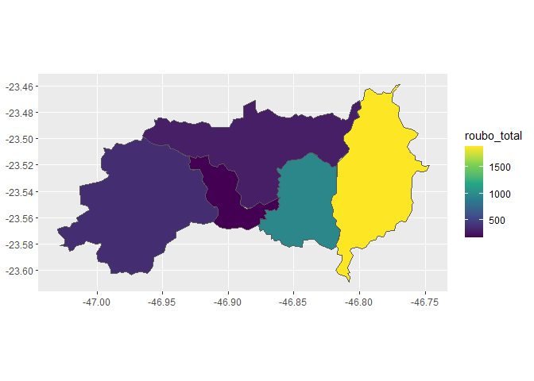

<!-- README.md is generated from README.Rmd. Please edit that file -->

``` r
`%>%`<-magrittr::`%>%`
library(ggplot2)
library(gganimate)
#> Warning: package 'gganimate' was built under R version 4.0.5
library(dplyr)
#> 
#> Attaching package: 'dplyr'
#> The following objects are masked from 'package:stats':
#> 
#>     filter, lag
#> The following objects are masked from 'package:base':
#> 
#>     intersect, setdiff, setequal, union
library(sf)
#> Warning: package 'sf' was built under R version 4.0.4
#> Linking to GEOS 3.8.0, GDAL 3.0.4, PROJ 6.3.1
library(tidyr)
library(purrr)
```

# tcc

<!-- badges: start -->
<!-- badges: end -->

The goal of tcc is to …

What is special about using `README.Rmd` instead of just `README.md`?
You can include R chunks like so:

``` r
dados<-readr::read_rds("data/ssp.rds")

dados %>% 
  dplyr::mutate(data = stringr::str_c(ifelse(mes <10,"0",""),mes,ano)) %>% 
  dplyr::group_by(ano, regiao_nome) %>% 
  dplyr::summarise(
      dplyr::across(.cols = where(is.numeric), 
                  .fns = sum, na.rm = TRUE)) %>% 
  ggplot2::ggplot() +
  ggplot2::geom_col(aes(x = ano, y = roubo_total))
#> `summarise()` has grouped output by 'ano'. You can override using the `.groups` argument.
```

<!-- -->

``` r
municipios_brasil <- readr::read_rds("data/municipios_todos.rds")

geom_sp<-municipios_brasil %>% 
  filter(abbrev_state == "SP")
  

fazer_grafico <- function(tab) {
  tab %>% 
    ggplot(aes(fill = roubo_total)) +
    scale_fill_viridis_c() +
    geom_sf(aes(geometry = geom))
}


regiao_norte<-c("Caieiras", "Cajamar", "Francisco Morato", "Franco da Rocha", "Mairiporã")

regiao_leste<-c("Arujá", "Biritiba-Mirim", "Ferraz de Vasconcelos", "Guararema", "Guarulhos", "Itaquaquecetuba", "Mogi das Cruzes", "Poá", "Salesópolis", "Santa Isabel", "Suzano")

regiao_sudeste<-c("Diadema", "Mauá", "Ribeirão Pires", "Rio Grande da Serra", "Santo André", "São Bernardo do Campo", "São Caetano do Sul")

regiao_sudoeste<-c("Cotia", "Embu", "Embu-Guaçu", "Itapecerica da Serra", "Juquitiba", "São Lourenço da Serra", "Taboão da Serra", "Vargem Grande Paulista")

regiao_oeste<-c("Barueri", "Carapicuíba", "Itapevi", "Jandira", "Osasco", "Pirapora do Bom Jesus", "Santana de Parnaíba")


dados_graficos <- dados %>%
  filter(municipio_nome %in% c(regiao_oeste)) %>% 
  select(municipio_nome, ano, roubo_total) %>% 
  group_by(ano, municipio_nome) %>% 
  summarise(roubo_total = sum(roubo_total, na.rm = TRUE)) %>% 
  left_join(geom_sp, by=c("municipio_nome" = "name_muni")) %>%
  filter(!is.na(abbrev_state)) %>%
  group_by(ano) %>% 
  tidyr::nest() %>% 
  mutate(grafico = map(data, fazer_grafico))
#> `summarise()` has grouped output by 'ano'. You can override using the `.groups` argument.

dados_graficos %>% 
  filter(ano %in% c(2015:2020)) %>% 
  pull(grafico)
#> [[1]]
```

<!-- -->

    #> 
    #> [[2]]

<!-- -->

    #> 
    #> [[3]]

<!-- -->

    #> 
    #> [[4]]

<!-- -->

    #> 
    #> [[5]]

<!-- -->

    #> 
    #> [[6]]

<!-- -->
