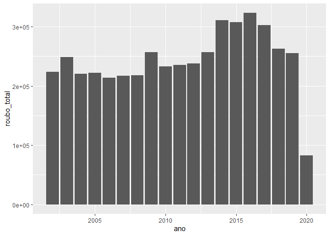
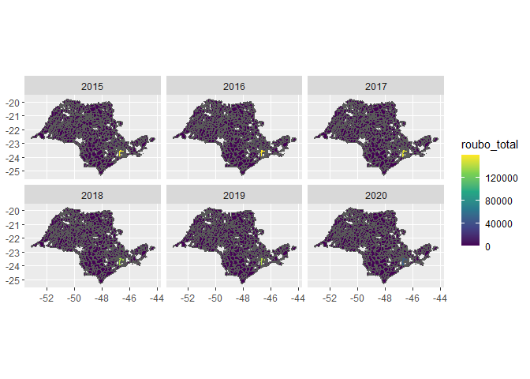

<!-- README.md is generated from README.Rmd. Please edit that file -->

``` r
`%>%`<-magrittr::`%>%`
library(ggplot2)
library(gganimate)
#> Warning: package 'gganimate' was built under R version 4.0.5
library(dplyr)
#> 
#> Attaching package: 'dplyr'
#> The following objects are masked from 'package:stats':
#> 
#>     filter, lag
#> The following objects are masked from 'package:base':
#> 
#>     intersect, setdiff, setequal, union
library(sf)
#> Warning: package 'sf' was built under R version 4.0.4
#> Linking to GEOS 3.8.0, GDAL 3.0.4, PROJ 6.3.1
```

# tcc

<!-- badges: start -->
<!-- badges: end -->

The goal of tcc is to …

What is special about using `README.Rmd` instead of just `README.md`?
You can include R chunks like so:

``` r
dados<-readr::read_rds("data/ssp.rds")

dados %>% 
  dplyr::mutate(data = stringr::str_c(ifelse(mes <10,"0",""),mes,ano)) %>% 
  dplyr::group_by(ano, regiao_nome) %>% 
  dplyr::summarise(
      dplyr::across(.cols = where(is.numeric), 
                  .fns = sum, na.rm = TRUE)) %>% 
  ggplot2::ggplot() +
  ggplot2::geom_col(aes(x = ano, y = roubo_total))
#> `summarise()` has grouped output by 'ano'. You can override using the `.groups` argument.
```

<!-- -->

``` r
municipios_brasil <- readr::read_rds("data/municipios_todos.rds")

dados_idh_muni <- abjData::pnud_min %>% 
  mutate(code_muni = as.double(muni_id))


geom_sp<-municipios_brasil %>% 
  filter(abbrev_state == "SP")
  
  
dados %>% 
  filter(ano >= 2015) %>%
  select(municipio_nome, ano, roubo_total) %>% 
  group_by(ano, municipio_nome) %>% 
  summarise(roubo_total = sum(roubo_total, na.rm = TRUE)) %>% 
  left_join(geom_sp, by=c("municipio_nome" = "name_muni")) %>%
  filter(!is.na(abbrev_state)) %>% 
  ggplot(aes(fill = roubo_total)) +
  facet_wrap(~ano) +
  scale_fill_viridis_c() +
  geom_sf(aes(geometry = geom))
#> `summarise()` has grouped output by 'ano'. You can override using the `.groups` argument.
```

<!-- -->

``` r
   

  
dados %>% summary(roubo_total)
#>       mes              ano       delegacia_nome     municipio_nome    
#>  Min.   : 1.000   Min.   :2002   Length:311833      Length:311833     
#>  1st Qu.: 3.000   1st Qu.:2006   Class :character   Class :character  
#>  Median : 6.000   Median :2011   Mode  :character   Mode  :character  
#>  Mean   : 6.426   Mean   :2011                                        
#>  3rd Qu.: 9.000   3rd Qu.:2015                                        
#>  Max.   :12.000   Max.   :2020                                        
#>  regiao_nome           estupro         estupro_total     estupro_vulneravel
#>  Length:311833      Min.   : 0.00000   Min.   : 0.0000   Min.   : 0.00000  
#>  Class :character   1st Qu.: 0.00000   1st Qu.: 0.0000   1st Qu.: 0.00000  
#>  Mode  :character   Median : 0.00000   Median : 0.0000   Median : 0.00000  
#>                     Mean   : 0.03494   Mean   : 0.4653   Mean   : 0.09784  
#>                     3rd Qu.: 0.00000   3rd Qu.: 0.0000   3rd Qu.: 0.00000  
#>                     Max.   :10.00000   Max.   :38.0000   Max.   :15.00000  
#>   furto_outros    furto_veiculos    hom_culposo_acidente_transito
#>  Min.   :  0.00   Min.   :  0.000   Min.   : 0.0000              
#>  1st Qu.:  0.00   1st Qu.:  0.000   1st Qu.: 0.0000              
#>  Median :  7.00   Median :  0.000   Median : 0.0000              
#>  Mean   : 30.05   Mean   :  6.259   Mean   : 0.2494              
#>  3rd Qu.: 38.00   3rd Qu.:  4.000   3rd Qu.: 0.0000              
#>  Max.   :999.00   Max.   :574.000   Max.   :32.0000              
#>  hom_culposo_outros   hom_doloso      hom_doloso_acidente_transito
#>  Min.   : 0.00000   Min.   : 0.0000   Min.   :0.000000            
#>  1st Qu.: 0.00000   1st Qu.: 0.0000   1st Qu.:0.000000            
#>  Median : 0.00000   Median : 0.0000   Median :0.000000            
#>  Mean   : 0.01502   Mean   : 0.3142   Mean   :0.001472            
#>  3rd Qu.: 0.00000   3rd Qu.: 0.0000   3rd Qu.:0.000000            
#>  Max.   :31.00000   Max.   :37.0000   Max.   :3.000000            
#>  hom_tentativa       latrocinio      lesao_corp_culposa_acidente_transito
#>  Min.   : 0.0000   Min.   :0.00000   Min.   :  0.000                     
#>  1st Qu.: 0.0000   1st Qu.:0.00000   1st Qu.:  0.000                     
#>  Median : 0.0000   Median :0.00000   Median :  2.000                     
#>  Mean   : 0.3485   Mean   :0.01935   Mean   :  7.131                     
#>  3rd Qu.: 0.0000   3rd Qu.:0.00000   3rd Qu.: 10.000                     
#>  Max.   :60.0000   Max.   :4.00000   Max.   :288.000                     
#>  lesao_corp_culposa_outras lesao_corp_dolosa lesao_corp_seg_morte
#>  Min.   :  0.000           Min.   :  0.000   Min.   :0.0000000   
#>  1st Qu.:  0.000           1st Qu.:  0.000   1st Qu.:0.0000000   
#>  Median :  0.000           Median :  5.000   Median :0.0000000   
#>  Mean   :  0.252           Mean   :  9.944   Mean   :0.0009588   
#>  3rd Qu.:  0.000           3rd Qu.: 13.000   3rd Qu.:0.0000000   
#>  Max.   :139.000           Max.   :353.000   Max.   :2.0000000   
#>   roubo_banco        roubo_carga      roubo_outros      roubo_total    
#>  Min.   : 0.00000   Min.   : 0.000   Min.   :  0.000   Min.   :  0.00  
#>  1st Qu.: 0.00000   1st Qu.: 0.000   1st Qu.:  0.000   1st Qu.:  0.00  
#>  Median : 0.00000   Median : 0.000   Median :  0.000   Median :  0.00  
#>  Mean   : 0.01215   Mean   : 0.423   Mean   :  2.806   Mean   : 14.85  
#>  3rd Qu.: 0.00000   3rd Qu.: 0.000   3rd Qu.:  0.000   3rd Qu.:  8.00  
#>  Max.   :17.00000   Max.   :85.000   Max.   :953.000   Max.   :954.00  
#>  roubo_veiculo     vit_hom_doloso   vit_hom_doloso_acidente_transito
#>  Min.   :  0.000   Min.   : 0.000   Min.   :0.000000                
#>  1st Qu.:  0.000   1st Qu.: 0.000   1st Qu.:0.000000                
#>  Median :  0.000   Median : 0.000   Median :0.000000                
#>  Mean   :  4.394   Mean   : 0.333   Mean   :0.001793                
#>  3rd Qu.:  1.000   3rd Qu.: 0.000   3rd Qu.:0.000000                
#>  Max.   :627.000   Max.   :37.000   Max.   :6.000000                
#>  vit_latrocinio  
#>  Min.   :0.0000  
#>  1st Qu.:0.0000  
#>  Median :0.0000  
#>  Mean   :0.0206  
#>  3rd Qu.:0.0000  
#>  Max.   :5.0000
```
